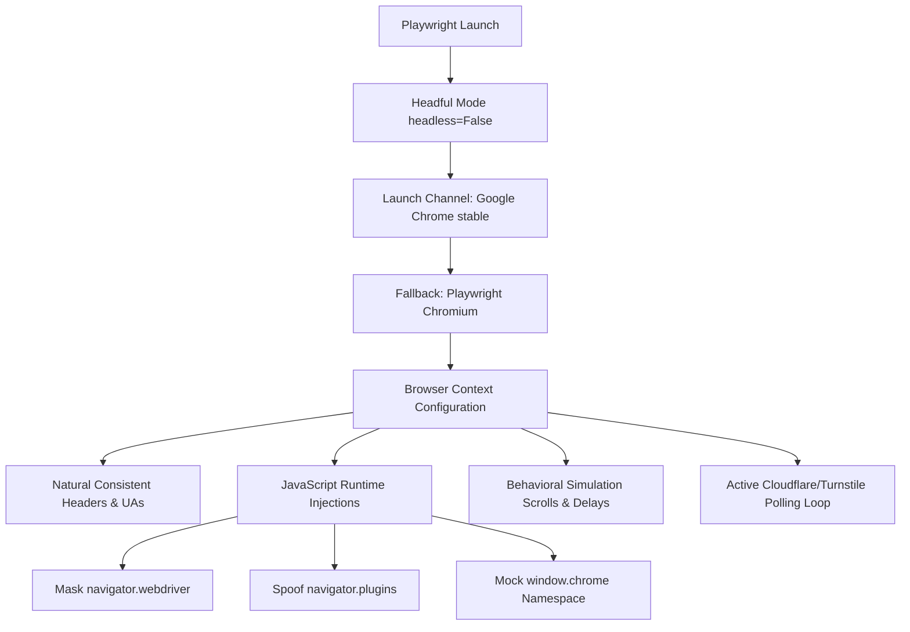

# Browser Fingerprinting Mitigation & Stealth Documentation

This document analyzes the design and mechanics of the stealth and browser fingerprinting mitigation techniques implemented in [fc_base.py](file:///D:/LT/SaveTheWeb/test/fc_base.py).

---

## Evasion Architecture Overview

The script implements client-side emulation layers to prevent simple automated browser checks from flagging the execution as a bot. It divides its anti-detection features into three main layers:



---

## Technical Breakdown

### 1. Unified Browser Launching & Headful Requirement
Modern Web Application Firewalls (WAFs) like Cloudflare identify headless browser execution instantly due to discrepancies in graphics card rendering, WebGL, and OS-specific font configurations.
* **Headful Execution:** Both crawling and search tasks run in headful mode (`headless=False`) to ensure standard rendering features are fully active.
* **Google Chrome Stable Integration:** The launcher requests the actual installed Google Chrome application (`channel="chrome"`). Using consumer-grade Chrome ensures standard TLS signatures, client hints, and browser properties. If Google Chrome is unavailable on the host, the script cleanly falls back to standard Chromium.

### 2. Natural Header & Asset Consistency
To prevent WAF flags triggered by browser fingerprint discrepancies:
* **Natural Header Alignment:** The script does not inject artificial headers or mismatching legacy User-Agents. It allows the browser engine to naturally send its matching native Client Hints (`sec-ch-ua`) and User-Agent headers, preventing detection vectors based on version mismatching.
* **Unblocked Resource Flows:** Static resources (like fonts, images, stylesheets) are **not** blocked. Turnstile security challenges require rendering consistency and network verification checks on assets (e.g. loading iframes from `challenges.cloudflare.com`); blocking these leads to immediate challenge failure.

### 3. Active Cloudflare / Turnstile Wait Loop
If the target website presents a security challenge page (e.g. status code `403` or title containing `"Just a moment..."`):
* **Turnstile Checkbox Click Interaction:** The loop inspects the frames of the page to locate any Cloudflare Turnstile iframes (`challenges.cloudflare.com`) and programmatically clicks the verification checkbox:
  ```python
  for frame in page.frames:
      if "challenges.cloudflare.com" in frame.url:
          checkbox = await frame.query_selector("input[type='checkbox']")
          if checkbox:
              await checkbox.click()
  ```
* **Auto-Screenshot Debugging:** Saves the live challenge page state to `cf_challenge_status.png` for diagnostics during execution loops.

### 4. Decoupled Structured Extraction
* To ensure data models (like cover images, authors, ratings, and chapters) are never pruned, the parser runs BeautifulSoup extraction on the **original, uncleaned DOM**.
* Once structured data is parsed, a separate cleaning pipeline (`HTMLCleaner.clean`) is executed on the HTML string to strip scripts, styles, and empty wrapper elements for raw markdown generation.

### 5. Runtime Environment Overrides (JavaScript Injection)
Playwright-controlled Chrome context overrides automation flags at browser initialization (`page.add_init_script`):

| Property Modified | Target Value / Action | Purpose |
| :--- | :--- | :--- |
| `navigator.webdriver` | `undefined` | Standard automation frameworks set this to `true`. This override masks the flag. |
| `navigator.plugins` | Dummy array `[1, 2, 3, 4, 5]` | Prevents detection scripts from flagging the empty plugin list typical of automated browsers. |
| `window.chrome` | Mocked runtime structure | Headless browsers lack standard runtime namespaces present in consumer versions of Google Chrome. |

---

> [!NOTE]
> **Defensive Context & Limitations**
> Bypassing Cloudflare Turnstile requires headful display capabilities. Because advanced WAF defenses continually update their threat database signals, the script prioritizes browser header alignment and real-user execution over static stealth overrides.
